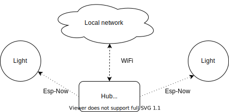

# ESP Now integration for ESPhome
First of all, this is based on a similar integration by [iphong](https://github.com/iphong/esphome-espnow), which is now updated to [MeshRC](https://github.com/iphong/lib-esp-rc). 
## Purpose
The purpose of this software is to enable communication between esp devices without a wifi connection. In the example the light acts as a slave and the hub controls the light. I have tried to make the communication as lightweight as possible and similar to service calls in HomeAssistant. The idea is explained in this diagram: 
<p align="center">
  
</p>

## Features
- Using a node running esphome you can control a light on a different node also running esphome with the communcation using esp-now. Changing colour, effects and brightness are supported. As of Jan 29, multiple lights are supported. Differentiation between lights is done using the MAC address.
- Since Feb 20 support for the ESP32 microcontroller is added.
- Nodes can either use their WiFi connection provided by esphome(Connecting to an Access Point or Setting up an Access point. See the [documentation](https://esphome.io/components/wifi.html)) or no Wi-Fi connection at all, which is in the ```light.yaml``` example. This must be initialized by ```MeshRC::setupwifi(${wifichannel});```, where ```${wifichannel}``` should be configured such that it uses the same channel as the hub(, this is a [substitution](https://esphome.io/guides/configuration-types.html?#substitutions)). So the hub should always connect to the same access point, this can be configured [here](https://esphome.io/components/wifi.html#connecting-to-multiple-networks).

## Improvements
- Add extra functionality, such as different transtion length and multiple lights per node.
- Add some return channel for the light to show that they are online. In this way, the Hub can relay this information to HomeAssistant.

## Goal
I wanted to have some nice lights in my garden, they should be controlleable by HomeAssistant so that they eventually would be able to react to movement.
### First attempt
Firstly, I decided to use [cheap commercial solar lights](https://offers.kd2.org/en/gb/lidl/pFpK/) and replace the hardware with some NeoPixel LEDs (WS2812 Ring). These LEDs would be controlled via an ESP chip from indoors. So all the data would travel underground to all the lights. All lights would be chained together so that every led in every light could be controlled individually. Unfortunately carrying the data over such a long distance underground proved almost impossible.
### Second attempt
As a second attempt, I decided to give each light it's own ESP-01s controller. They are very cheap (~1 USD) and they have wifi capability. I do however not want to use WiFi for all lights (4 at the moment) in my garden, since this would put some stress on my home network. Hence I decided to use the esp-now protocol to communicate between a hub and the lights.
