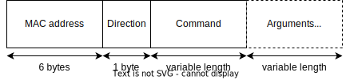
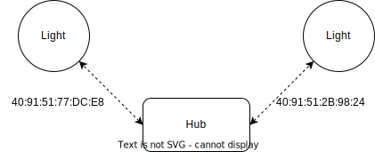

# ESP-Now integration for ESPhome
First of all, this is based on a similar integration by [iphong](https://github.com/iphong/esphome-espnow), which is now updated to [MeshRC](https://github.com/iphong/lib-esp-rc). 
## Purpose
The purpose of this software is to enable communication between esp devices without a wifi connection. In the example the light acts as a slave and the hub controls the light. I have tried to make the communication as lightweight as possible and similar to service calls in HomeAssistant. The idea is explained in this diagram 


## Features
- Using a node running esphome you can control a light on a different node also running esphome with the communication using esp-now. Changing colour, effects and brightness are supported. As of Jan 29, multiple lights are supported. Differentiation between lights is done using the MAC address.
- Support for the ESP32 microcontroller is added for the Hub.
- Nodes can run Binary, Monochromatic, RGB and RGBW Lights.
- The configured transition length in the hub will be transmitted to the nodes.
- Each node can run multiple lights.
- Nodes can either use their WiFi connection provided by esphome(Connecting to an Access Point or Setting up an Access point. See the [documentation](https://esphome.io/components/wifi.html)) or no Wi-Fi connection at all, which is in the ```light.yaml``` example. This must be initialized by ```MeshRC::setupwifi(${wifichannel});```.
- Connect the lights to a power supply. I have all my lights connected behind a relay, which turns the lights on when they must produce light. However, Initializing esp-now takes about a second, so using a power supply, we can easily send the command a little bit later to give esp-now time to initialize and save a lot of power.
- Send the esp-now messages using a dedicated esp8266. (see [examples](examples)).

### Communication Protocol
All messages sent over esp-now are of the form:



- MAC address is the address of the light node, this is unique and basically functions as the channel on which messages are being sent. Nodes only listen to messages send to their own address.
- Direction can be either '>' or '<'. '>' means the messages is for the light node (from the hub) and '<' means the message is for the hub (from the light node).
- Examples of command can be PING, or LIGHT, these are implemented in the esphome files and can be easily changed or added.
- Arguments can supplement a command with information, such as parameters for the lights.

This implementation is used to generate so-called channels, these are based on the mac addresses and allow us to easily set up communication with different nodes and easily direct the traffic.



## Improvements
- Alter the communication protocol, such that messages have to be confirmed to be received by the hub. (Now it is somewhat similar to UDP, we want to change it to TCP-ish) (Use [painlessmesh](https://gitlab.com/painlessMesh/painlessMesh))
- Add support for more types of lights, such as RGBCT.

## Goal
I wanted to have some nice lights in my garden, they should be controllable by HomeAssistant so that they eventually would be able to react to movement.

### First attempt
Firstly, I decided to use [cheap commercial solar lights](https://offers.kd2.org/en/gb/lidl/pFpK/) and replace the hardware with some NeoPixel LEDs (WS2812 Ring). These LEDs would be controlled via an ESP chip from indoors. So all the data would travel underground to all the lights. All lights would be chained together so that every led in every light could be controlled individually. Unfortunately carrying the data over such a long distance underground proved almost impossible.

### Second attempt
As a second attempt, I decided to give each light it's own ESP-01s controller. They are very cheap (~1 USD) and they have wifi capability. I do however not want to use WiFi for all lights (4 at the moment) in my garden, since this would put some stress on my home network. Hence I decided to use the esp-now protocol to communicate between a hub and the lights.

### Third attempt
One of the downsides of esp-now is that it only works if you are connected to the right WiFi channel. To solve this, I added the possibility to use a second esp8266 as the transmitter of the esp-now signal. The hub communicates with this transmitter over UART (Serial), and the transmitter just relays the signal. Using this strategy, WiFi channels can no longer cause issues and it should even be possible to use an ESP32 with an Ethernet connection as a hub.

## Usage
For this guide, I assume that you have esphome up and running and are familiar with how it all works. We need one microcontroller as a hub and one as a light.
- Clone this repository.
- Put the lib folder in you esphome folder.
- Choose a pair of [examples](./examples/) that suit your purpose.
- Change the data in the examples, such that they are correct for your devices
  - __(If you use the UART transmitter you can skip this step - You only need to pick a WiFi channel)__ First of all, you need to determine the WiFi channel of the Access Point. You can either download an app such as [WiFi Analyzer](https://play.google.com/store/apps/details?id=com.farproc.wifi.analyzer&hl=nl&gl=US) to determine the WiFi channel of the hub or look at the logs from any esphome device. These will show to what channel your node is connected. Then, make sure that your node always connects to this Access Point, see the esphome [documentation](https://esphome.io/components/wifi.html#connecting-to-multiple-networks).
  - Now configure the light node to also connect to this WiFi channel using the substitution:
  ```
  substitutions:
    devicename: light
    wifichannel: "7"
  ```
  - If you use a UART transmitter, you should use Arduino to flash [serial-to-espnow.ino](serial-to-espnow/serial-to-espnow.ino) to your transmitter (I suggest using an ESP-01s for this function). Make sure to fill in the correct wifi channel in line 12 (`MeshRC::setupwifi(<channel>);`). Make the following connections with the ESP-01s:
  
  | **HUB** | **ESP-01s (transmitter)** |
  |---------|---------------------------|
  | RX      | TX                        |
  | TX      | RX                        |
  | 3v      | 3v                        |
  | GND     | GND                       |
  - Find the MAC address of the light node and write it in the hub in its substitutions:
  ```
  substitutions:
    devicename: hub
    light_address_1: "{0xff,0xff,0xff,0xff,0xff,0xff};"
  ```
- Flash the two devices, try looking at the log in a controlled environment first to see if it works.
